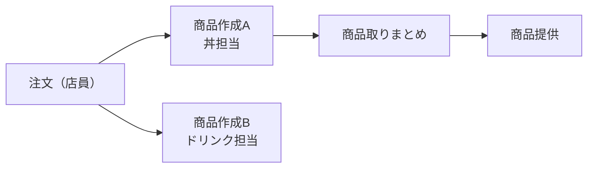

# 注文・制作管理システム（架空飲食店）

どんぶり・ジュースなどを販売する架空の飲食店を想定し、  
**注文 → 制作 → 取りまとめ → 提供** の流れを管理するシステム。

店員が注文を入力し、  
丼担当・ドリンク担当に分かれて商品を制作し、  
商品を取りまとめて提供する店舗オペレーションを想定している。

将来的に **売上管理・在庫管理機能の追加**を見据えている。

---

## 使用技術
- フロントエンド：React
- バックエンド：PHP
- 開発環境：MAMP

---

## システム全体フロー

## 画面一覧
| 画面 | 内容 |
|---|---|
| Z | 注文・会計（店員操作） |
| A | 丼商品の作成 |
| B | ドリンク商品の作成 |
| C | 丼商品の取りまとめ |
| D | 商品提供表示（呼び出し） |

## Z：注文画面
店員が商品選択と会計を行う画面。  
**1会計＝1注文**として扱い、注文データは**会計キー押下時点で確定・保存**される。

- **テンキー**  
  商品数や金額の入力に使用する。

- **IN / OUT / 会計キー**  
  - 上段IN/OUT → 会計キー：店内／持ち帰りを確定して会計開始  
  - 下段IN/OUT：押した時点で会計を開始

- **タブ**  
  商品カテゴリ切替（丼・ドリンク・クーポンなど）。

- **商品一覧**  
  商品の画像と名称を表示し、押下で選択できる。

- **モード変更**  
  一般、クリアランス指定、値段表示など（今後拡張予定）。

## A・B：商品作成画面
注文された商品を担当ごとに作成する画面。

- **A：丼商品の作成**
- **B：ドリンク商品の作成**

作成場所ごとに対応商品を表示し、  
ボタン操作で作成完了として一覧から消去する。  
※画面上は消えるが、**注文データは全件保存**される。

## C：商品取りまとめ画面
- Aで作成完了した商品が表示される  
- B（ドリンク）はこの工程には関与しない  
- 商品が揃ったものを確認し、提供工程へ進める  

## D：商品提供（呼び出し）
- Cで商品を消すと「提供待ち」として表示される  
- **提供待ち**：注文番号を大きく表示し、注文内容は表示しない  
- **提供済み**：表示から消える  

## データ保持（売上・履歴を見据えた前提）
本システムでは、将来的な売上管理・在庫管理を見据え、  
**全ての注文データを永続的に保存**する。

### 保存される注文データ項目
| 項目 | 内容 |
|---|---|
| 注文番号 | レジナンバー2桁 + 00〜99（例：0123） |
| 日時 | 会計キー押下時の日時 |
| IN / OUT | 店内または持ち帰り |
| 商品 | 注文された商品 |
| 数量 | 商品ごとの数量 |

### 補足
- 注文番号はレジナンバーと連番を組み合わせて管理する  
- 注文データは会計キー押下時点で確定する  
- 画面上で注文が消えても、データは保持される  
- 日付はシステム側で自動付与し、1日の区切りとして利用する  

## 目的
- 注文から提供までの流れを明確化
- 制作工程の分業を前提としたUI設計
- 店舗オペレーションの効率化

## 今後の拡張
- 売上管理（注文データの集計）
- 在庫管理
- モード切替機能の拡張
