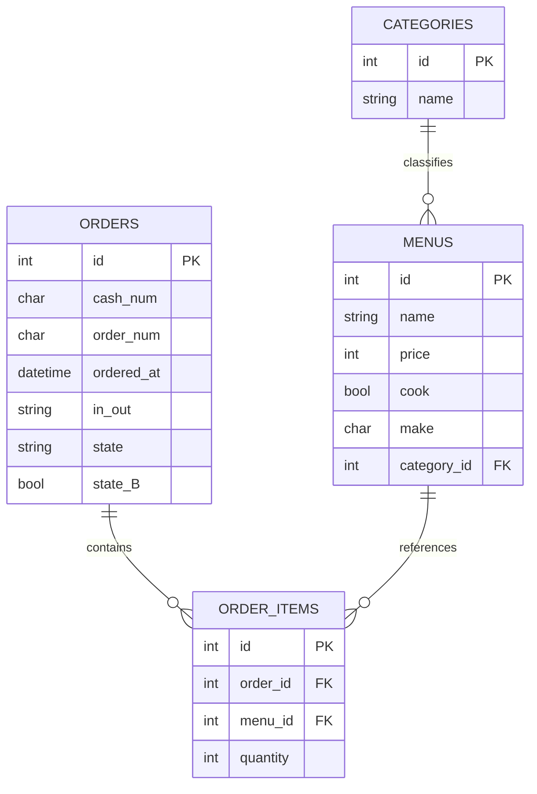

# SPEC.md – データ設計

本ドキュメントでは、  
注文・制作管理システムにおける **注文データおよび進捗状態の保持構造**を定義する。

本システムは、  
画面上で注文が消えても **すべての注文データを永続的に保持**し、  
将来的な **売上管理・在庫管理** への拡張を前提とする。

---

## 注文データの考え方

- **1会計＝1注文**
- 注文は **会計キー押下時点で確定**
- 画面上で消えても、データは削除しない
- 注文の進捗は **注文単位で管理**する
- 1日の区切りは **日時（日付）で自動管理**

---

## テーブル構成概要



---

## orders テーブル（注文）

1回の会計につき1レコードを保持し、  
**注文全体の進捗状態**を管理する。

### カラム定義

| カラム名 | 型 | 内容 |
|---|---|---|
| id | int | 主キー |
| cash_num | char | レジ番号 |
| order_num | char | 表示用注文番号（23形式） |
| ordered_at | datetime | 会計キー押下時の日時 |
| in_out | string | IN（店内） / OUT（持ち帰り） |
| state | string | 注文の進捗状態 |
| state_B | bool | ドリンク作成工程の表示制御 |

---

### state の定義

| state | 意味 |
|---|---|
| A | 調理工程（丼作成中） |
| C | 会計確定後、C未処理 |
| D | 提供待ち（未呼び出し） |
| cool | 呼び出し済み・未提供 |
| fin | 提供済み（完了） |

※ `cool` は **D画面で1回押された状態**を表す。  
※ `fin` の注文は、画面には表示されないが **履歴として保持**される。

---

### state_B の考え方

- true  
  → ドリンク作成が必要で、B画面に表示される
- false  
  → ドリンク作成完了（B画面から消える）

※ `state_B` は **画面表示制御用の補助状態**であり、  
復帰の根拠には使用しない。  
必要に応じて、注文明細から再構築可能。

---

## order_items テーブル（注文明細）

1つの注文に含まれる商品情報を保持する。

### カラム定義

| カラム名 | 型 | 内容 |
|---|---|---|
| id | int | 主キー |
| order_id | int | orders.id への外部キー |
| menu_id | int | menus.id への外部キー |
| quantity | int | 注文数量 |

---

## menus テーブル（商品マスタ）

注文可能な商品情報を管理する。

### カラム定義

| カラム名 | 型 | 内容 |
|---|---|---|
| id | int | 主キー |
| name | string | 商品名 |
| price | int | 価格 |
| cook | bool | 調理が必要か |
| make | char | 作成担当（A / B） |
| category_id | int | カテゴリID |

### 補足
- `cook=false` の商品は **作成工程を通らず** Cで処理される
- `make` は **調理担当**を示す  
  （Cは取りまとめ工程のため、商品マスタでは扱わない）

---

## categories テーブル（商品カテゴリ）

商品カテゴリを管理する。

### カラム定義

| カラム名 | 型 | 内容 |
|---|---|---|
| id | int | 主キー |
| name | string | カテゴリ名 |

---

## データ保持ポリシー

- 注文データは **削除しない**
- 提供済みの注文も **全件保持**
- 売上管理・分析は orders / order_items を基に行う
- 日付指定により、1日単位・期間単位の集計が可能

---

## 画面状態とDB状態の対応

| 画面 | 表示条件 |
|---|---|
| C | 会計確定済み & C未処理 |
| D | C処理済み & state = D または cool |
| 表示なし | state = fin |

---

## 将来拡張想定

- 売上集計機能
- 在庫管理機能
- 注文履歴・分析表示
- 再呼び出し機能（必要に応じて）
---

## 本ドキュメント（SPEC.md）の位置づけ

本ドキュメント（SPEC.md）は、  
README に記載したシステム概要・画面仕様を前提として、  
**内部設計・データ設計・状態管理を詳細に定義するための資料**である。

README では  
- システム全体の流れ  
- 各画面（Z / A / B / C / D）の役割と操作  

を中心に説明しているのに対し、  
SPEC.md では以下を明確にしている。

- 注文データを削除せずに保持する設計方針
- 注文・注文明細・商品マスタのテーブル構成
- 注文の進捗状態（A → C → D → cool → fin）の定義
- サーバ再起動・障害発生時でも画面状態を復元できる考え方
- 画面操作とDB状態を1対1で対応させるための設計意図

本システムは、  
**画面上で注文が消えることと、データが削除されることを分離**して設計しており、  
将来的な売上管理・在庫管理・履歴分析を行うための基盤として  
本 SPEC.md を設計ドキュメントとして位置づけている。

実装時・仕様変更時には、  
README と併せて本ドキュメントを参照することで、  
設計意図を保ったまま拡張・修正できる構成となっている。
## API設計

### 目的
フロントエンド（React）とバックエンド（PHP）が HTTP API を介して  
注文データ・商品マスタ・工程状態をやり取りし、  
画面（Z / A / B / C / D）の動作を成立させる。

### 前提
- 通信形式：JSON（`Content-Type: application/json`）
- 認証は現時点では扱わない（将来拡張）
- **内部処理は `order_id`（DBのid）を主キーとして扱う**
- `order_num`（`0123`形式）は表示用番号であり、**重複を許容**する

---

## 共通レスポンス仕様

### 成功時
- `200 OK` / `201 Created`

### 失敗時（共通エラー形式）
- `400 Bad Request`：入力不正
- `404 Not Found`：対象注文が存在しない
- `409 Conflict`：不正な状態遷移など

```json
{
  "result": "ng",
  "error": {
    "code": "INVALID_STATE_TRANSITION",
    "message": "state=C から FINISH は実行できません"
  }
}
```

---

## 1) 注文作成（Z：会計確定）

### POST `/api/orders.php`

Z画面で **会計キーが押された時点**で呼び出される。  
**1会計＝1注文**として注文と注文明細を登録する。

### Request
```json
{
  "cash_num": "01",
  "in_out": "IN",
  "items": [
    { "menu_id": 10, "quantity": 1 },
    { "menu_id": 21, "quantity": 2 }
  ]
}
```

### サーバ側処理（仕様）
- `orders` を新規作成
- `order_items` を items 分作成
- **初期 state 決定ルール**
  - items に `cook=true` かつ `make="A"` が含まれる  
    → `state = "A"`
  - それ以外（Bのみ / cook=falseのみ）  
    → `state = "C"`
- `state_B` 初期化
  - items に `make="B"` が含まれる → `true`
  - 含まれない → `false`

### Response
```json
{
  "result": "ok",
  "order_id": 123,
  "display_order_num": "0123",
  "state": "A",
  "state_B": true
}
```

---

## 2) 注文一覧取得（画面表示用）

### GET `/api/orders.php?screen={screen_ID}`

各画面が表示対象の注文を取得する。

### Query Parameters
| パラメータ | 内容 |
|---|---|
| screen | A / B / C / D |

### 用途例
- A画面：screen=A`state=A`
- C画面：screen=C`state=C`
- D画面：screen=D（サーバ側で state IN ('D','cool') に変換）
- B画面：screen=B（サーバ側で state_B=true に変換）

### Response
```json
[
  {
    "order_id": 123,
    "display_order_num": "0123",
    "in_out": "IN",
    "items":[
      {
      "name":"牛丼",
      "quantity": 1
      },
    ]
  }
]
```

---

## 3) 注文詳細取得（レシート・確認用）

### GET `/api/orders?id={order_id}`

C画面でのレシート発行や詳細確認に使用する。

### Response
```json
{
  "order_id": 123,
  "display_order_num": "0123",
  "in_out": "IN",
  "items": [
    {
      "name": "牛丼",
      "cook": true,
      "make": "A",
      "quantity": 1
    }
  ]
}
```


---

## 4) 状態更新（工程ボタン操作）

### PATCH `/api/orders_state.php?id={order_id}`

工程ボタン操作による状態遷移を行う。  
**クライアントは state を直接指定せず、action を送信する。**

### Request
```json
{ "action": "A_DONE" }

```


### action一覧
| action | 内容 | 遷移 |
|---|---|---|
| A_DONE | 丼作成完了 | `A → C` |
| C_DONE | C処理完了 | `C → D` |
| CALL | 呼び出し | `D → cool` |
| FINISH | 提供完了 | `cool → fin` |

### Response
```json
{
  "result": "ok",
  "order_id": 123,
  "state": "D"
}
```

---

## 5) ドリンク完了（B画面）

### PATCH `/api/orders_drink.php?id={order_id}`

B画面でドリンク作成完了時に呼び出す。

### Request
```json
{ "done": true }
```


### Response
```json
{
  "result": "ok",
  "order_id": 123,
  "state_B": false
}
```

---

## 6) マスタ取得

### GET `/api/categories.php`
```json
[
  { "category_id": 1, "name": "丼" },
  { "category_id": 2, "name": "ドリンク" }
]
```

### GET `/api/menus.php`

商品マスタ（menus テーブル）を  
**カテゴリ単位で取得するための API**。

主に **注文画面（Z）での商品一覧表示**に使用し、  
カテゴリタブの切り替えに応じて呼び出される。

---

### 取得仕様

- **必ずカテゴリIDを指定して取得する**
- カテゴリ未指定の場合はエラーとする

#### Query Parameters（必須）

| パラメータ | 内容 |
|---|---|
| category_id | 取得対象のカテゴリID |

---

### Response

```json
[
  {
    "menu_id": 10,
    "name": "牛丼"
  },
  {
    "menu_id": 11,
    "name": "豚丼"
  }
]
```

---

## 画面とAPI対応

| 画面 | 使用API |
|---|---|
| Z | POST `/api/orders.php` |
| A | GET `/api/orders.php?screen=A` / PATCH `/api/orders_state.php?id={order_id}` |
| B | GET `/api/orders.php?screen=B` / PATCH `/api/orders_drink.php?id={order_id}` |
| C | GET `/api/orders.php?screen=C` / GET `/api/orders.php?id={order_id}` / PATCH `/api/orders_state.php?id={order_id}` |
| D | GET `/api/orders.php?screen=D` / PATCH `/api/orders_state.php?id={order_id}` |
