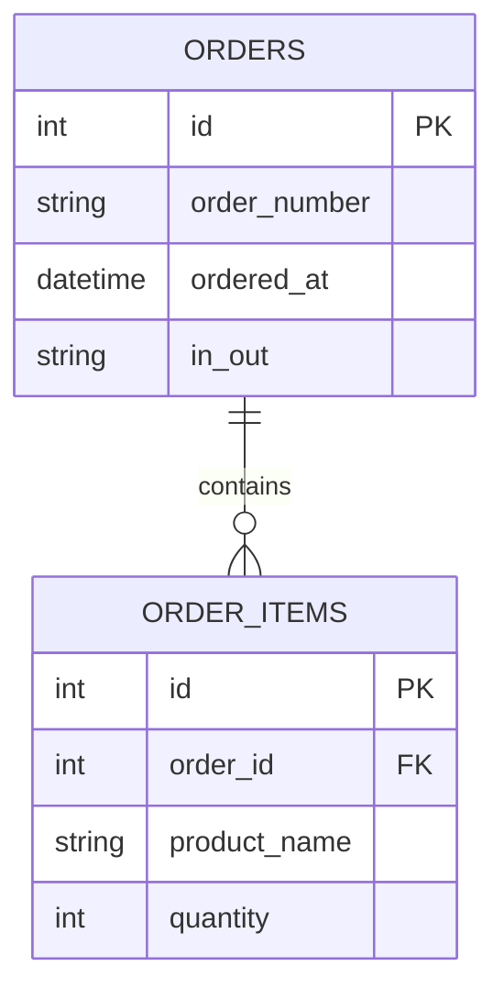

# SPEC.md – データ設計

本ドキュメントでは、  
注文・制作管理システムにおける **注文データの保持構造**を定義する。

将来的な売上管理・在庫管理を見据え、  
**全ての注文データを永続的に保存**することを前提とする。

---

## 注文データの考え方

- **1会計＝1注文**
- 注文は **会計キー押下時点で確定**
- 画面上で消えても、データは削除しない
- 1日の区切りは **日時（日付）で自動管理**

---

## テーブル構成概要


## orders テーブル（注文）

1回の会計につき1レコードを保持する。

### カラム定義

| カラム名 | 型 | 内容 |
|---|---|---|
| id | int | 主キー |
| order_number | string | 注文番号（レジナンバー2桁 + 00〜99） |
| ordered_at | datetime | 会計キー押下時の日時 |
| in_out | string | IN（店内） / OUT（持ち帰り） |

### 補足
- 注文番号例：`0123`
- 日付は `ordered_at` をもとに日別集計を行う
- 注文の削除は行わず、履歴として保持する

---

## order_items テーブル（注文明細）

1つの注文に含まれる商品情報を保持する。

### カラム定義

| カラム名 | 型 | 内容 |
|---|---|---|
| id | int | 主キー |
| order_id | int | orders.id への外部キー |
| product_name | string | 商品名 |
| quantity | int | 注文数量 |

### 補足
- 商品は「商品名＋数量」の組み合わせで保持する
- 将来的に商品マスタ・在庫管理と連携することを想定している

---

## データ保持ポリシー

- 提供済み・完了した注文も **全件保持**
- 売上管理・分析は orders / order_items をもとに行う
- 日付指定により、1日単位・期間単位の集計が可能

---

## 将来拡張想定

- 商品マスタテーブルの追加
- 在庫テーブルとの連携
- 注文ステータス（調理中／提供待ち等）の追加

## API設計

本システムでは、フロントエンド（React）とバックエンド（PHP）が  
HTTP API を介して注文データをやり取りする。

---

## 注文登録 API

### POST /orders

注文画面（Z）で **会計キーが押された時点**で呼び出される。  
1会計につき1注文を登録する。

### リクエストボディ（例）

```json
{
  "order_number": "01-23",
  "ordered_at": "2025-01-01T12:34:56",
  "in_out": "IN",
  "items": [
    {
      "product_name": "牛丼",
      "quantity": 1
    },
    {
      "product_name": "オレンジジュース",
      "quantity": 2
    }
  ]
}

```

### 処理内容
- 注文番号の重複チェック
- orders テーブルに注文を登録
- order_items テーブルに商品明細を登録

### レスポンス（例）

```json
{
  "result": "ok",
  "order_id": 123
}

```

---

## 注文一覧取得 API（制作・提供用）

### GET /orders

制作画面（A・B）、取りまとめ画面（C）、提供画面（D）で使用する。

### クエリパラメータ（例）

| パラメータ | 内容 |
|---|---|
| date | 日付指定（YYYY-MM-DD） |
| in_out | IN / OUT（任意） |

### レスポンス（例）

```json
[
  {
    "order_id": 123,
    "order_number": "01-23",
    "ordered_at": "2025-01-01T12:34:56",
    "in_out": "IN",
    "items": [
      {
        "product_name": "牛丼",
        "quantity": 1
      }
    ]
  }
]
```

---

## 注文ステータス更新 API（工程進行）

※ 現時点では **画面制御が中心**で、  
API上の明示的なステータス更新は将来拡張とする。

### 将来想定エンドポイント（参考）
- PATCH /orders/{order_id}/status

---

## API設計方針
- 注文データは削除しない  
- 画面上で消えても、DB上では保持する  
- 日付指定で1日の注文を全件取得できる  
- 売上・在庫管理は本APIを拡張して対応する  


